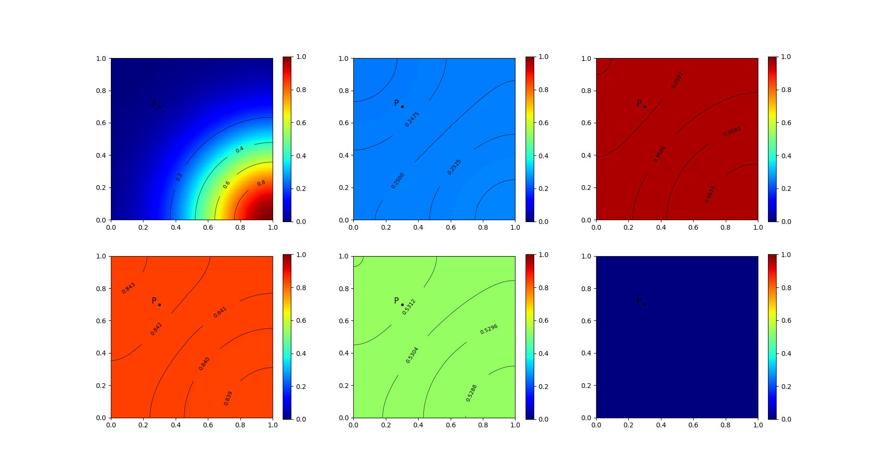
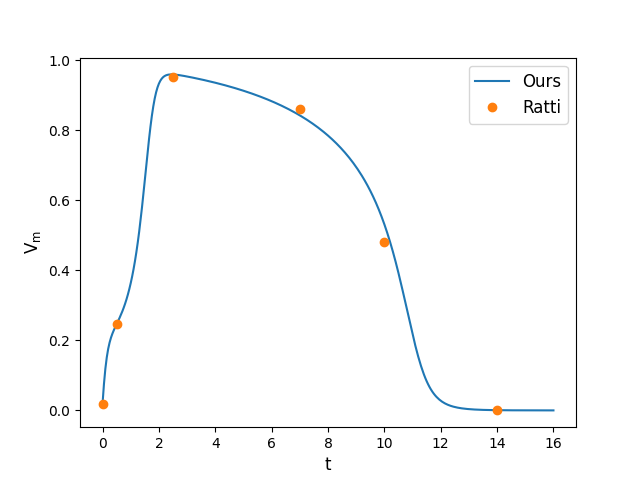
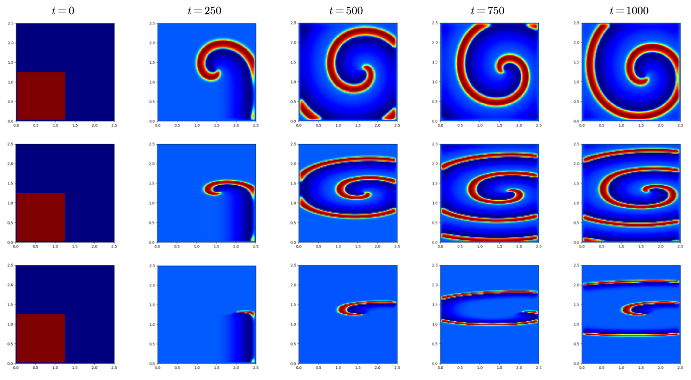
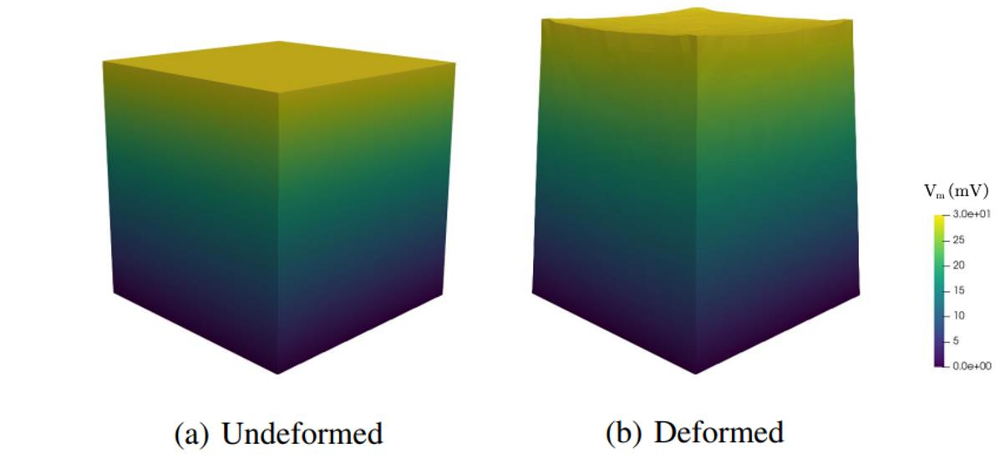
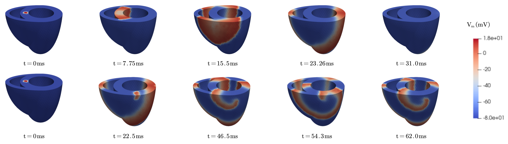
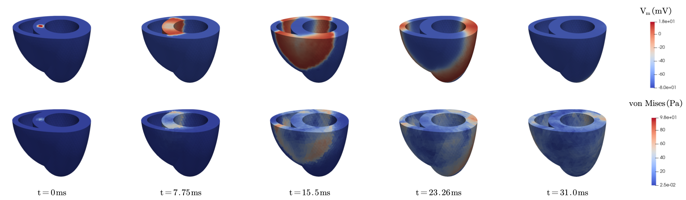
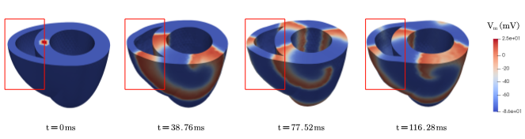

# bibm_cardiac_sim_2023

## Requirements
```commandline
python -m pip install -r requirements.txt
```
## Example
All examples are stored in folder "./example".
- example1: 2D Propagation of Transmembrane Potential


- example2: 2D Spiral Wave

- example3: Active Mechanical Response

- example4: Electromechanical Couple in a 3D Biventricular Heart




